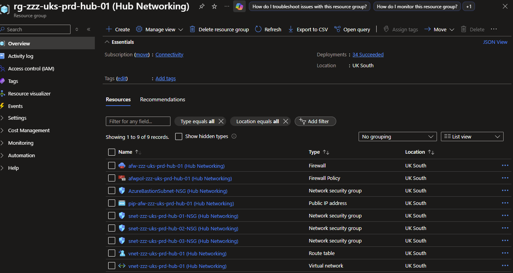

# Azure Firewall Rules as Code

[](https://opensource.org/licenses/MIT)

Manage Azure Firewall Policy rules using CSV files, Bicep, PowerShell, and Azure DevOps. This repository provides Infrastructure as Code (IaC) tooling to export, validate, and deploy firewall rules with automated PR validation to ensure quality before deployment.

## ✨ Features

- 📝 **CSV-based Rule Management** - Edit firewall rules in spreadsheet-friendly CSV format
- ✅ **Automated Validation** - PR checks ensure rules are properly formatted before merge
- 🚀 **Azure DevOps Integration** - CI/CD pipelines for deployment automation
- 🏗️ **Hub Network Deployment** - Complete hub-and-spoke network infrastructure
- 📊 **Export Existing Rules** - Extract current rules from Azure Firewall Policy to CSV
- 🔄 **Bidirectional Sync** - Export from Azure, edit locally, deploy back to Azure

## 📋 Table of Contents

- [Quick Start](#quick-start)
- [Prerequisites](#prerequisites)
- [Initial Setup](#initial-setup)
- [Working with Firewall Rules](#working-with-firewall-rules)
- [Pull Request Validation](#pull-request-validation)
- [Deployment](#deployment)
- [Documentation](#documentation)
- [Credits](#credits)

## 🚀 Quick Start

```powershell
# 1. Clone the repository
git clone https://github.com/awood-ops/AzureFirewallRulesAsCode.git
cd AzureFirewallRulesAsCode

# 2. Configure environment
Copy-Item config/prd/.env.template config/prd/.env
# Edit config/prd/.env with your values

# 3. Import environment variables
.\scripts\Set-EnvParams.ps1

# 4. Create Log Analytics workspace
.\scripts\New-LogAnalyticsWorkspace.ps1

# 5. Deploy hub network
.\pipeline-scripts\Deploy-Infrastructure.ps1

# 6. Validate firewall rules CSV
.\pipeline-scripts\Test-FirewallRulesCsv.ps1

# 7. Deploy firewall rules
.\pipeline-scripts\Invoke-DeployFirewallPolicyRules.ps1
```

## 📦 Prerequisites

- **Azure Subscription** with appropriate permissions
- **PowerShell 7+** 
- **Azure CLI** or **Azure PowerShell** modules
- **Bicep CLI** (for infrastructure deployment)
- **VS Code** (recommended) with Azure extensions
- **Azure DevOps** (for CI/CD pipelines)

## ⚙️ Initial Setup

### 1. Log Analytics Workspace

Start by provisioning a Log Analytics workspace for monitoring and diagnostics:

```powershell
.\scripts\New-LogAnalyticsWorkspace.ps1
```

### 2. Environment Configuration

Environment variables are managed via `.env` files located in `config/{environment}/`:

- **Production**: `config/prd/.env`
- **Testing**: `config/testing/.env`

**Required variables:**
```properties
ENVIRONMENT_CODE="prd"
WORKLOAD_CODE="hub"
LOCATION="eastus"
COMPANY_CODE="contoso"
SUBSCRIPTION_ID="00000000-0000-0000-0000-000000000000"
LOG_ANALYTICS_SUBSCRIPTION_ID="00000000-0000-0000-0000-000000000000"
LOG_ANALYTICS_RESOURCE_GROUP_NAME="rg-logs-prd"
LOG_ANALYTICS_WORKSPACE_NAME="log-hub-prd"
VNET_ADDRESS_PREFIX="10.0.0.0/20"
FIREWALL_PREMIUM_ENABLED="true"
DIAGNOSTICS_ENABLED="true"
```

**Local setup:**
```powershell
.\scripts\Set-EnvParams.ps1
```
*Note: This will reload VS Code to apply environment variables*

**Pipeline setup:**  
Variables are automatically imported during the "Import Environment Variables from File" step.

### 3. Deploy Hub Network

Deploy the hub-and-spoke network infrastructure:

```powershell
.\pipeline-scripts\Deploy-Infrastructure.ps1
```

This uses [Azure Verified Modules](https://aka.ms/avm) and Azure Deployment Stacks for robust infrastructure provisioning.

**Expected result:**



## 🔥 Working with Firewall Rules

### Rule Management Workflow

```
┌─────────────┐      ┌──────────┐      ┌──────────┐      ┌────────────┐
│   Export    │ ───> │   Edit   │ ───> │ Validate │ ───> │   Deploy   │
│  from Azure │      │   CSV    │      │   Rules  │      │  to Azure  │
└─────────────┘      └──────────┘      └──────────┘      └────────────┘
```

### 1. Export Existing Rules

Extract rules from your current Azure Firewall Policy:

```powershell
.\pipeline-scripts\Export-AzFirewallPolicyRulesToCsv.ps1 `
    -SubscriptionId "00000000-0000-0000-0000-000000000000" `
    -ResourceGroupName "rg-firewall-prd" `
    -FirewallPolicyName "afwp-hub-prd" `
    -OutputPath ".\config\parameters\FirewallRules\FirewallRules.csv"
```

### 2. Edit Rules

Open `config/parameters/FirewallRules/FirewallRules.csv` and make changes:

- **Add new rules** - Copy existing rows and modify
- **Update priorities** - Change rule collection priorities
- **Modify destinations** - Update FQDNs, IPs, or ports
- **Change actions** - Switch between Allow/Deny

**Example CSV structure:**
```csv
RuleCollectionGroup,RuleCollectionGroupPriority,RuleCollectionName,RuleCollectionPriority,RuleCollectionAction,RuleCollectionType,RuleType,RuleName,SourceType,Source,Protocols,TerminateTLS,DestinationPorts,DestinationType,Destination
DevOpsAgents,110,GitHub,180,Allow,FirewallPolicyFilterRuleCollection,ApplicationRule,GitHub,SourceAddresses,10.100.1.0/24,Https:443,,,TargetFqdns,github.com,*.github.com
```

### 3. Validate Rules

**Before committing**, validate your changes locally:

```powershell
# Basic validation
.\pipeline-scripts\Test-FirewallRulesCsv.ps1

# Validate specific file
.\pipeline-scripts\Test-FirewallRulesCsv.ps1 -PolicyCsvPath ".\config\parameters\FirewallRules\FirewallRules.csv"

# Strict mode (warnings = errors)
.\pipeline-scripts\Test-FirewallRulesCsv.ps1 -Strict
```

**What's validated:**
- ✅ CSV formatting (quotes, delimiters, structure)
- ✅ Priority conflicts and duplicates
- ✅ IP addresses and CIDR notation
- ✅ FQDN formats (supports wildcards like `*.microsoft.com`)
- ✅ Protocol and port formats
- ✅ Rule completeness (required fields)
- ✅ Priority ranges (100-65000)
- 🔒 Destination restrictions (blocks `*` and `0.0.0.0/0` in Allow rules)

### 4. Deploy Rules

Deploy validated rules to Azure:

```powershell
Connect-AzAccount

.\pipeline-scripts\Invoke-DeployFirewallPolicyRules.ps1
```

**Optional parameters:**
```powershell
.\pipeline-scripts\Invoke-DeployFirewallPolicyRules.ps1 `
    -SubscriptionId "00000000-0000-0000-0000-000000000000" `
    -ResourceGroupName "rg-firewall-prd" `
    -FirewallPolicyName "afwp-hub-prd" `
    -PolicyCsvPath ".\config\parameters\FirewallRules\FirewallRules.csv" `
    -TemplateParameterFile ".\config\parameters\HubNetworking\main.bicepparam"
```

*By default, the script extracts parameters from the Bicep parameter file.*

## ✅ Pull Request Validation

**Automated quality gates prevent broken rules from being deployed.**

### How It Works

```
Developer creates branch
    ↓
Edits CSV file
    ↓
Commits & pushes
    ↓
Creates Pull Request ──→ Validation Pipeline Runs
    ↓                           ↓
    ├─→ ✅ Pass ──→ PR can be merged
    └─→ ❌ Fail ──→ PR blocked until fixed
```

### Setup (One-time)

1. **Create the pipeline**
   ```
   Azure DevOps → Pipelines → New Pipeline
   → Existing YAML → .azuredevops/PR-Validation.yaml
   ```

2. **Configure branch policy** ⭐ *This blocks bad PRs*
   ```
   Repos → Branches → main → ... → Branch Policies
   → Build Validation → + → Select "PR-Validation"
   → Policy requirement: Required ✅
   ```

3. **Test it**
   - Create a test branch
   - Make a CSV change
   - Open PR to `main`
   - Watch validation run automatically

### What Gets Checked

| Check | Examples | Impact |
|-------|----------|--------|
| **CSV Format** | Balanced quotes, proper delimiters | ❌ Blocks PR |
| **Priority Conflicts** | Duplicate priorities in same group | ❌ Blocks PR |
| **IP/CIDR** | Valid: `10.0.0.0/24`, Invalid: `10.0.0.0/33` | ❌ Blocks PR |
| **FQDNs** | Valid: `*.github.com`, Invalid: `github..com` | ❌ Blocks PR |
| **Protocols** | Valid: `Https:443`, Invalid: `Https444` | ❌ Blocks PR |
| **Ports** | Valid: `1-65535`, Invalid: `70000` | ❌ Blocks PR |
| **Completeness** | Missing Source/Destination | ⚠️ Warning |
| **Security** | Allow rules with destination `*` or `0.0.0.0/0` | ❌ Blocks PR |

📖 **Full guide:** [docs/PR-Validation-Setup.md](docs/PR-Validation-Setup.md)  
📚 **Validation reference:** [docs/CSV-Validation-Reference.md](docs/CSV-Validation-Reference.md)

## 🚀 Deployment

### Local Deployment

```powershell
# Connect to Azure
Connect-AzAccount

# Deploy rules
.\pipeline-scripts\Invoke-DeployFirewallPolicyRules.ps1
```

### Azure DevOps Pipeline

1. **Setup pipeline** from `.azuredevops/Deploy-Firewall-Rules.yaml`
2. **Configure service connection** in pipeline variables
3. **Update environment file** at `config/prd/.env`
4. **Run pipeline** manually or on commit to `main`

**Pipeline triggers:**
- Automatic on changes to `config/parameters/FirewallRules.csv`
- Manual run from Azure DevOps

## 📚 Documentation

| Document | Description |
|----------|-------------|
| [PR-Validation-Setup.md](docs/PR-Validation-Setup.md) | Complete guide to setting up PR validation with branch policies |
| [CSV-Validation-Reference.md](docs/CSV-Validation-Reference.md) | Quick reference for validation script and rules |
| [Test-FirewallRulesCsv.ps1](pipeline-scripts/Test-FirewallRulesCsv.ps1) | Validation script with inline documentation |
| [Invoke-DeployFirewallPolicyRules.ps1](pipeline-scripts/Invoke-DeployFirewallPolicyRules.ps1) | Deployment script with parameter reference |

## 🏗️ Repository Structure

```
AzureFirewallRulesAsCode/
├── .azuredevops/              # Azure DevOps pipelines
│   ├── Deploy-Core-Networking.yaml
│   ├── Deploy-Firewall-Rules.yaml
│   └── PR-Validation.yaml     # ← PR validation pipeline
├── config/
│   ├── parameters/
│   │   ├── FirewallRules/     # ← Firewall rules CSV files
│   │   └── HubNetworking/     # Hub network parameters
│   ├── prd/                   # Production environment
│   └── testing/               # Testing environment
├── docs/                      # ← Documentation
├── modules/                   # Bicep modules
├── pipeline-scripts/          # Deployment & validation scripts
│   ├── Test-FirewallRulesCsv.ps1        # ← Validation script
│   └── Invoke-DeployFirewallPolicyRules.ps1
└── scripts/                   # Setup scripts
```

## 🤝 Contributing

1. Fork the repository
2. Create a feature branch (`git checkout -b feature/amazing-feature`)
3. Make your changes
4. Run validation: `.\pipeline-scripts\Test-FirewallRulesCsv.ps1`
5. Commit your changes (`git commit -m 'Add amazing feature'`)
6. Push to the branch (`git push origin feature/amazing-feature`)
7. Open a Pull Request

## 📝 License

This project is licensed under the MIT License - see the [LICENSE](LICENSE) file for details.

## 🙏 Credits

This repository builds upon excellent work by:
- **[Will Moselhy](https://github.com/WillyMoselhy/AzureFirewallPolicyExportImport)** - Original export/import functionality
- **[Justin Mendon](https://github.com/mendondev/AzureFirewallRulesAsCode)** - Rules as Code implementation

---

**Questions or Issues?** Open an issue or reach out to the maintainers.